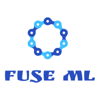

# FuseML - Flexible Universal Service orchestration for Machine Learning

  

For an updated roadmap please click (here)[https://github.com/fuseml/fuseml/projects/1]

Build your own custom MLOps orchestration workflows from composable automation recipes adapted to your favorite AI/ML tools, to get you from ML code to inference serving in production as fast as lighting a fuse.



## Overview

Use FuseML to build a coherent stack of community shared AI/ML tools to run your ML operations. FuseML is powered by a flexible framework designed for consistent operations and a rich collection of integration formulas reflecting real world use cases that help you reduce technical debt and avoid vendor lock-in.

## FuseML and the State of MLOps 

The machine learning software domain provides an impressive collection of specialized AI/ML software libraries, frameworks, and platforms that **Data Scientists**, **Data Engineers**, and **DevOps Engineers** can use to coordinate and automate their activities. They have to support a wide range of services, from data extraction and exploration to model training to inference serving and monitoring.
Choosing the right set of tools to suit the needs of your machine learning project isn't an easy task. To make matters worse, this set of tools you eventually decide to use might not be compatible and interoperable by default, so often there's additional work that needs to be done to have a functional and comprehensive MLOps stack attuned to your target infrastructure. What starts as a simple machine learning project eventually ends up being an inflexible **DYI MLOps** platform accruing a lot of technical debt and locking you into a fixed set of tools.

*Wouldn't it be great if there was a software solution that could solve this complexity and simply **Fuse** together your favorite **AI/ML** tools, while at the same time being flexible enough to allow you to make changes later on without incurring massive operational costs?*

**FuseML** aims to solve this and more by providing:

* An MLOps framework as the medium dynamically integrating together the AI/ML tools of your choice.
* An extensible tool built through collaboration, where Data Engineers and DevOps Engineers can come together and contribute with reusable integration code and use-cases addressing their specific needs and tools, that everyone else can benefit from.
* A set of extensible integration abstractions and conventions defined around common AI/ML concepts and implemented through tool-specific plugins and automation recipes. The abstractions are specific enough to support a complex orchestration layer to be implemented on top but at the same time flexible enough not to hide nor infringe upon the nuances of the various AI/ML tools they are wrapped around.
* An ML orchestrator combining aspects of MLOps and GitOps together into a set of services that Data Scientists, Data Engineers and DevOps Engineers can use to collaboratively manage the end-to-end lifecycle of their AI/ML projects, from code to production, across infrastructure domains.

What **FuseML** is **NOT**:

* An opinionated open source MLOps platform. Flexibility and extensibility are FuseML's core principles. Instead of being a set of tightly integrated components, it relies on extension mechanisms and custom automation recipes to dynamically and loosely integrate the 3rd party AI/ML tools of your choice.
* A complete lifecycle manager. FuseML's flexibility does come with a cost, which is vital to reduce complexity: managing the complete lifecycle (installation and upgrade processes) of supported 3rd party AI/ML tools is out of scope. However, FuseML will provide registration and auto-detection mechanisms for existing 3rd party tool installations, and may even go so far as to add lifecycle management to its list of supported extension mechanisms.

## FuseML Principles

* *Flexibility* - create and manage dynamic MLOps workflows connecting different AI/ML tools across multiple infrastructure domains

* *Extensibility* - leverage FuseML's set of abstractions and extension mechanisms to add support for your favorite AI/ML tools

* *Composability* - build complex MLOps workflows for your projects out of composable building blocks implementing a wide range of machine learning functions     

* *Collaboration* - use MLOps automation and tool integration recipes created in collaboration by all AI/ML team roles - Data Scientists, Data Engineers, and DevOps Engineers

* *GitOps for Machine Learning* - extend what traditional GitOps does with code to all other types of artifacts specific to machine learning - models and datasets, as well as other byproducts of a DevOps workflow (e.g. packages, container images) to provide features such a end-to-end versioning, tracking and reproducibility

## Inception and Direction

FuseML originated as a fork of our sister open source project [Carrier](https://github.com/SUSE/carrier), a lightweight open source PaaS built on top of Kubernetes, then has been gradually transformed and infused with the MLOps concepts that make it the AI/ML orchestration tool that it is today.

The FuseML team is still in the process of defining the project strategy, but we can say with some certainty that the project will develop in the following main directions aligned with the stated principles:
1. adding features and enhancements to improve flexibility and extensibility
2. add support for more community shared AI/ML tools
3. create more composable automation blocks adapted to the existing as well as new AI/ML tools

## Basic Workflow

The basic FuseML workflow can be described as a GitOps type of workflow that starts with your ML code and automatically runs all the steps necessary to build and serve your machine learning model. FuseML's job begins when your machine learning code is ready for execution.

1. install the FuseML Ochestrator in a kubernetes cluster of your choice (see [Installation Instructions](# Install))
2. write your code using the AI/ML library of your choice (e.g. TensorFlow, PyTorch, SKLearn, XGBoost)
3. organize your code using one of the conventions or experiment tracking tools supported by FuseML
4. use the FuseML CLI to push your code to the FuseML Orchestrator instance and, optionally, supply parameters to customize the end-to-end MLOps workflow
5. from this point onward, the process is completely automated: FuseML takes care of all aspects that involve building and packaging code, creating container images, running training jobs, storing and converting ML models in the right format and finally serving those models

## Supported 3rd Party Tools

### Experiment Tracking and Versioning

* MLFlow
* DVC (TBD)

### Model Training

* DeterminedAI (TBD)

### Model Serving and Monitoring

* MLFLow
* KNative Serving
* Seldon Core (coming soon)
* KFServing (coming soon)

## Usage

### Install

```bash

$ fuseml install

```
### Uninstall

```bash

$ fuseml uninstall

```

### Push an application

Run the following command for any supported application directory (e.g. one of the applications inside the [examples directory](examples)).

```bash

$ fuseml push NAME PATH_TO_APPLICATION_SOURCES

```

Note that the path argument is __optional__.
If not specified the __current working directory__ will be used.
Always ensure that the chosen directory contains a supported application.

### Delete an application

```bash

$ fuseml delete NAME

```

### Create a separate org

```bash

$ fuseml create-org NAME

```

### Target an org

```bash

$ fuseml target NAME

```

### List all commands

```bash

$ fuseml help

```

### Detailed help for each command

```bash

$ fuseml COMMAND --help

```

## Configuration

FuseML places its configuration at `$HOME/.config/fuseml/config.yaml` by default.

For exceptional situations, this can be overridden by either specifying

* The global command-line option `--config-file`, or

* The environment variable `FUSEML_CONFIG`.
